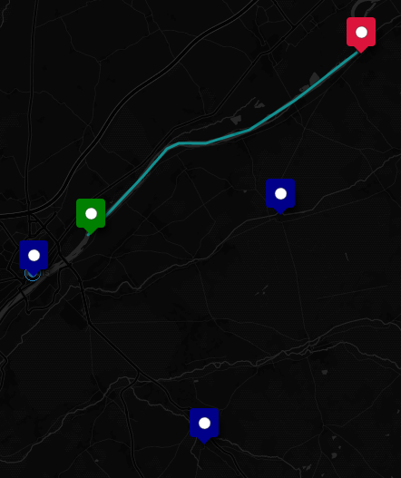

## Cavereau à Bréhémont 6 jours
[Lien](https://rando-canoe-france.com/rando-6-jours-cavereau-brehemont)

[Carte avec les lieux d'intéret](https://umap.openstreetmap.fr/fr/map/anonymous-edit/1208778:MvWL7TE7JfSv0qb_HxJ7rlsjCuSvp-IrV5CC2c_QEDM)

Les paysage ça va etre globalement du plat et des champs (et oui c'est la loire), des villages et des villes + une departemental qui suis la loire.

### etape

**Jour 1 - [Cavereau](https://maps.app.goo.gl/emWCPHkiWigAEEvr9) -> [Base loire kayak](https://maps.app.goo.gl/2QhBKZVP26XNfzVH7) (20km - 4h de rame)**

Visite : Chateaux de Chambord, Cheverny et blois.

Chambord et Cheverny c'est "loin" de la Loire, faut prendre les transports mais c'est +1h chacun. Sinon c'est taxi

On s'arrete juste avant blois et c'est une ville qui est sur la Loire donc plus simple à visiter.

Il y a quelque truc sympa sur les rives, des chateaux ou des truc historique du genre. C.F la carte intéractive

Apparemment Blois c'est joli et c'est surtout là qu'il faut visiter pour le jour 1

Trajet qui suit la loire

**Jour 2 - [Base loire kayak](https://maps.app.goo.gl/2QhBKZVP26XNfzVH7) -> Chaumont (20km - 4h de rame)**

Pas grand chose à voire sur cette partie, le chateau de Chaumont sur Loire. Des petit village en bord de fleuve mais sinon passer blois c'est surtout le fleuve et nous.

Visite : Château et Jardin de Chaumont sur Loire

Trajet:

**Jour 3 - Chaumont -> Amboise (18km - 4h de rame)**

Visite : Château d'Amboise, Clos Lucé (Dernière demeure de léonard de Vinci)

Quelque visite à Amboise mais entre pas trop, faut pagayer

**Jour 4 - Amboise -> Vouvray (14km - 3h de rame)**

Visite : Caves troglodytiques en bord de Loire, village de Montlouis/Loire et Maison de Loire

Pas grand chose sur cette partie, il y a une ile appeller ile au chats.

Sur le site de l'office du tourisme de Montlouis il parle que des domaine viticole et vinicole

**Jour 5 - Vouvray -> Saint Etienne de chigny (17km - 3h30 de rame)**

Visite : Vielle bille de Tours et les quais de Loire lors du portage au pont Wilson, Chateau de Luynes

Globalement il y a Tours sur le chemin, c'est un peu moins de la moitié de l'itinéraire.

**Jour 6 - Saint Etienne de chigny -> Bréhémont (22km - 4h de rame)**

Visite : Tour de Cinq Mars la Pile, Château de Langeais

Il y a un petit chateau à cinq Mars la pile. Il y a également des tours un peu partout dans la ville (c'est des tombes gallo romaine).

Il y a un château à langeais et c'est à peu pres tout

## Quelques photos du centre val de loire 

.jpeg)
.jpeg)

.jpeg)
.jpeg)
.jpeg)